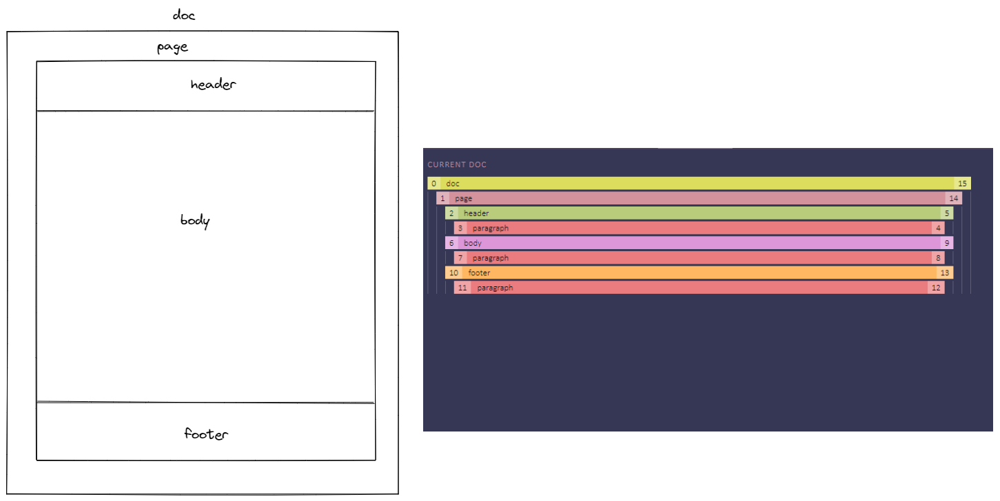
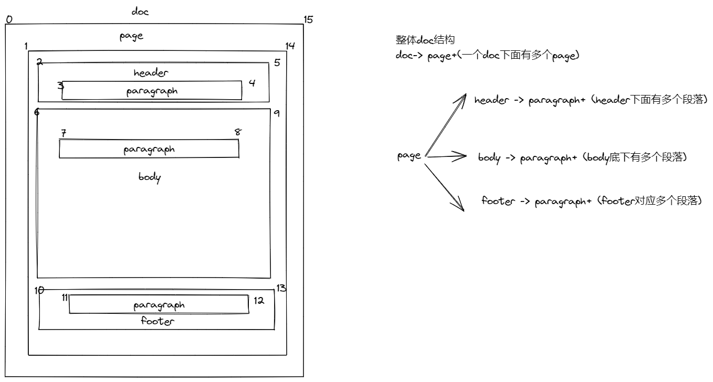
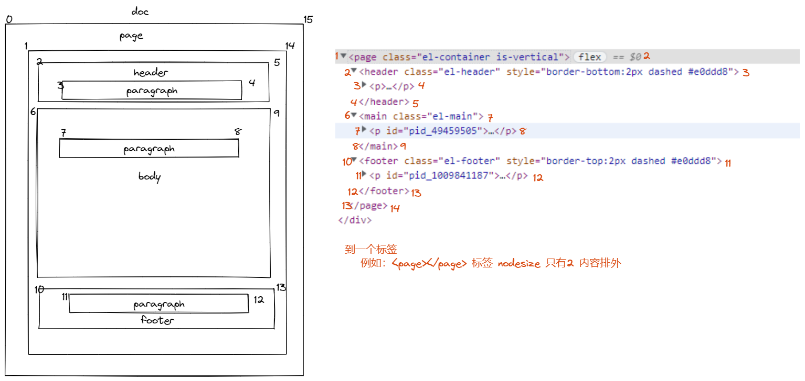

# cassie editor 分页设计

#### 分页思路

tiptap 页面生命周期函数执行流程
1：键盘键入事件
2：触发view->update方法
3：触发state->apply方法
4：触发appendTransaction
执行逻辑:1->2->3->4

1）键入的时候计算 当前page的高度是否超出了 设置高度
2）如果超出，则在state中设置 insert或delete标志位
3）在Transaction的时候 执行页面分页逻辑
分页逻辑
如果插入的点永远在最后一页的最后一行则插入一个新的页面
如果插入的点不在最后一行例如总共5页 插入在了第三页
则逻辑比较复杂  把所有的 分页数据放到一个页面里
然后挨个计算页面里的每一个段落的高度 递归执行

#### 示意图

映射关系图

#### 结构对应

#### html 结构

